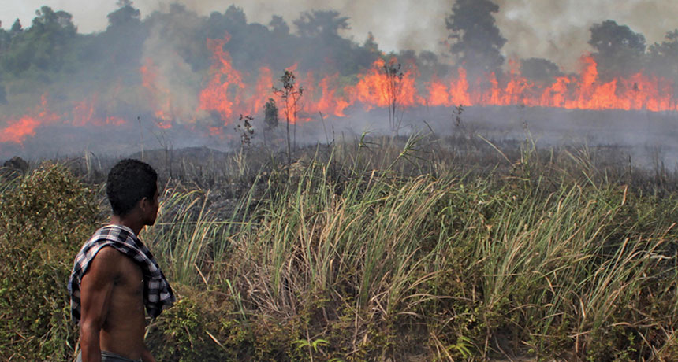
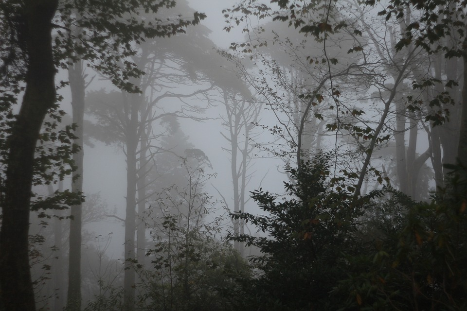

# forest_fire_detection
<h3>Wildfires are an important phenomenon on a global scale, as they are responsible for large amounts of economic and environmental damage. These effects are being exacerbated by the influence of climate change.It is important to detect fire and warn the people in charge. So you can create Smoke and Fire Detection Algorithms by using this dataset.</h3>

<h1>fire :</h1>

 
<h1>Non fire :</h1>
 

